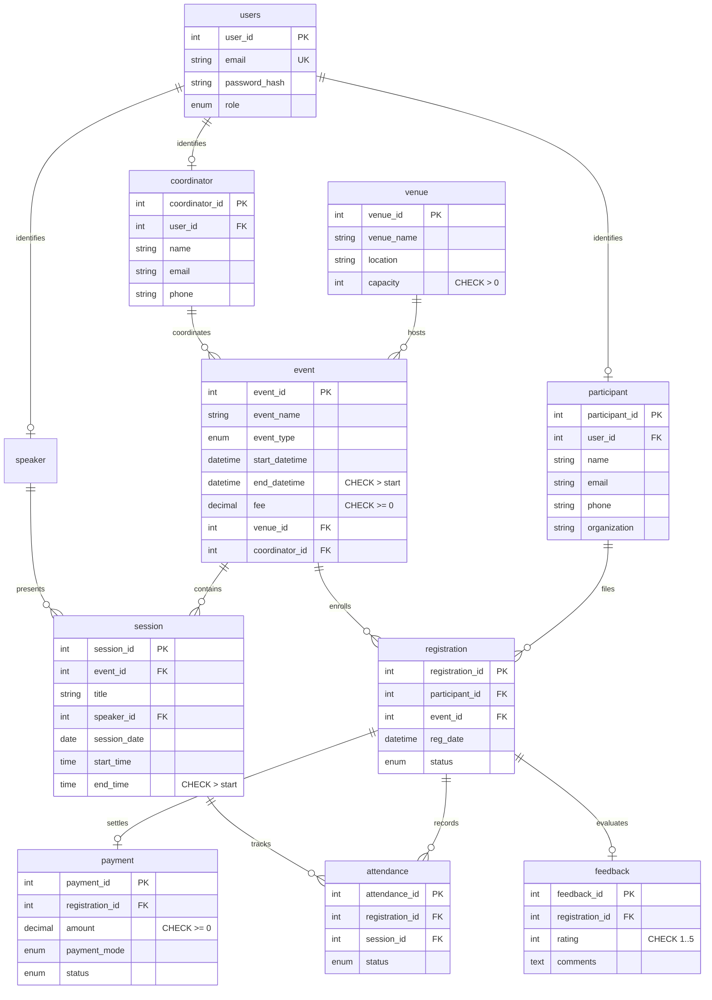

# Event Registration & Venue Scheduling System


---

## 📋 Executive Summary
The **Event Registration & Venue Scheduling System** is an enterprise-grade university event management platform engineered with database integrity at its core. Unlike conventional applications that delegate business logic solely to backend scripts, this system enforces critical constraints (venue overlap prevention, seating capacity caps, chronological time validation, and accreditation thresholds) directly at the MySQL 8 engine level using **stored triggers, check constraints, foreign keys, and analytical views**.

A modern Express REST API translates database state signals to structured HTTP responses, while a high-performance React (Vite) interface styled in the official **Woxsen Presentation Theme** (`#FFFAF5` warm cream, `#6AA84F` campus green, `#4C8A3A` accent, 16px radius, zebra-striped tables) provides seamless workflows for Administrators, Coordinators, Speakers, Participants, and University Executives.

---

## ⚡ Quick Start (Under 5 Steps)

### Prerequisites
- **Node.js**: v18.0.0 or higher (v20+ recommended)
- **MySQL Server**: 8.0 or higher running on `127.0.0.1:3306`

```bash
# 1. Clone repository and navigate to project root
cd event-system

# 2. Configure environment credentials
cp .env.example .env
# Note: Ensure DB_PASSWORD is set correctly (e.g., DB_PASSWORD="StrongPass#123")

# 3. Install backend and frontend dependencies
npm install
npm install --prefix client

# 4. Initialize database schema, triggers, views, and seed dataset
npm run db:setup

# 5. Launch full-stack application (Express backend on :5000 + Vite on :5173)
npm run dev
```

*Open your browser and navigate to:* `http://localhost:5173`

---

## 👥 Seed Accounts & Demo Logins

All sample accounts are pre-populated with secure bcrypt password hashes. Quick 1-click autofill pills are also available on the web login screen.

| Role | Email Address | Password | Permissions & Scope |
| :--- | :--- | :--- | :--- |
| **Administrator** | `admin@woxsen.edu.in` | `Admin@123` | Full control: events, venues, sessions, attendance, payments, certificates, reports |
| **Coordinator 1** | `coord1@woxsen.edu.in` | `Coord@123` | Schedule events, assign speakers/sessions, conduct roll call attendance, approve registrations |
| **Coordinator 2** | `coord2@woxsen.edu.in` | `Coord@123` | Operational management and event coordination |
| **Speaker 1** | `speaker1@woxsen.edu.in` | `Speaker@123` | Session roster, view registered attendees, manage workshop topic schedule |
| **Participant 1** | `participant1@woxsen.edu.in` | `Participant@123` | Browse catalog, register, complete mock UPI/Card payments, submit feedback, download certificate |
| **Management** | `management@woxsen.edu.in` | `Manage@123` | Executive analytics, Recharts visualizations, capacity audits, CSV exports for all 6 reports |

---

## 🏗️ System Architecture & Database Design

### Relational Schema Diagram (Mermaid)



### Table Catalog (11 Tables)
1. `users`: Authentication identities with bcrypt hashed credentials and role enums.
2. `venue`: Campus facilities with seating capacity check constraints (`capacity > 0`).
3. `coordinator`: University faculty and event coordinators.
4. `speaker`: Keynote presenters, industry guest lecturers, and workshop hosts.
5. `event`: University calendar bookings with time constraints (`end_datetime > start_datetime`).
6. `session`: Granular event agenda items with temporal check constraints (`end_time > start_time`).
7. `participant`: Registered students, external delegates, and university staff.
8. `registration`: Enforces `UNIQUE(participant_id, event_id)` to disallow duplicate registrations.
9. `payment`: Financial transaction ledger with check constraint (`amount >= 0`).
10. `attendance`: Roll call tracking with `UNIQUE(registration_id, session_id)`.
11. `feedback`: Post-event evaluation reviews with rating constraint (`rating BETWEEN 1 AND 5`).

---

## 🛡️ Database Business Rules & Integrity Constraints

All business rules are codified directly within MySQL 8 engine definitions:

### 1. Venue Overlap Prevention (Triggers: `trg_venue_overlap_ins` & `trg_venue_overlap_upd`)
Prevents double-booking a venue by checking if any other event occupies the same venue within overlapping intervals `(NEW.start_datetime < end_datetime AND NEW.end_datetime > start_datetime)`:
```sql
CREATE TRIGGER trg_venue_overlap_ins BEFORE INSERT ON event FOR EACH ROW
BEGIN
  IF EXISTS (SELECT 1 FROM event WHERE venue_id = NEW.venue_id
             AND NEW.start_datetime < end_datetime AND NEW.end_datetime > start_datetime) THEN
    SIGNAL SQLSTATE '45000' SET MESSAGE_TEXT = 'Venue already booked for this time';
  END IF;
END;
```

### 2. Venue Seating Capacity Cap (Trigger: `trg_capacity`)
Prevents overbooking beyond physical hall limits. Counts active registrations (`status <> 'Cancelled'`) against venue capacity:
```sql
CREATE TRIGGER trg_capacity BEFORE INSERT ON registration FOR EACH ROW
BEGIN
  IF (SELECT COUNT(*) FROM registration WHERE event_id = NEW.event_id AND status <> 'Cancelled')
     >= (SELECT v.capacity FROM venue v JOIN event e ON e.venue_id = v.venue_id WHERE e.event_id = NEW.event_id) THEN
    SIGNAL SQLSTATE '45000' SET MESSAGE_TEXT = 'Venue capacity reached';
  END IF;
END;
```

### 3. Certificate Eligibility Computation (Analytical View: `certificate_eligibility`)
Dynamically calculates the exact percentage of sessions attended per participant and evaluates accreditation eligibility according to Woxsen University's 75% threshold rule:
```sql
CREATE VIEW certificate_eligibility AS
SELECT r.registration_id, r.participant_id, r.event_id,
  ROUND(100 * SUM(a.status='Present') / NULLIF((SELECT COUNT(*) FROM session s WHERE s.event_id = r.event_id),0), 1) AS attendance_pct,
  (100 * SUM(a.status='Present') / NULLIF((SELECT COUNT(*) FROM session s WHERE s.event_id = r.event_id),0)) >= 75 AS eligible
FROM registration r LEFT JOIN attendance a ON a.registration_id = r.registration_id
GROUP BY r.registration_id, r.participant_id, r.event_id;
```

### 4. Database-to-HTTP Error Translation
The Express middleware `errorHandler.js` intercepts native MySQL error codes and translates them to semantic HTTP responses:
- `SQLSTATE 45000` (Trigger SIGNAL) $\rightarrow$ `HTTP 409 Conflict`
- `ER_DUP_ENTRY` (Duplicate key / unique constraint) $\rightarrow$ `HTTP 409 Conflict`
- `ER_CHECK_CONSTRAINT_VIOLATED` (Check constraint violation) $\rightarrow$ `HTTP 400 Bad Request`

---

## 🔍 How to Verify Database Rules (Manual Cut & Paste)

### 1. Test Venue Conflict in MySQL CLI
```sql
-- Event 1 is booked at Venue 1 on 2026-11-15 from 09:30 to 17:30.
-- Attempting to book an overlapping event at Venue 1 will fail:
INSERT INTO event (event_name, event_type, start_datetime, end_datetime, fee, venue_id, coordinator_id)
VALUES ('Conflicting Summit', 'Workshop', '2026-11-15 11:00:00', '2026-11-15 13:00:00', 0, 1, 1);
-- Result: ERROR 1644 (45000): Venue already booked for this time
```

### 2. Test Venue Capacity Limit in MySQL CLI
```sql
-- Event 6 is held at Venue 4 (Workshop Lab 40, capacity = 40 seats).
-- There are already 40 active registrations. Inserting a 41st will fail:
INSERT INTO registration (participant_id, event_id, status)
VALUES (1, 6, 'Confirmed');
-- Result: ERROR 1644 (45000): Venue capacity reached
```

### 3. Verify Certificate Attendance View
```sql
SELECT * FROM certificate_eligibility WHERE event_id = 4 ORDER BY attendance_pct DESC;
-- Result:
-- Participant 1: 100.0% -> eligible = 1 (Eligible)
-- Participant 2:  75.0% -> eligible = 1 (Eligible)
-- Participant 3:  50.0% -> eligible = 0 (Ineligible)
```

### 4. Test Check Constraint in MySQL CLI
```sql
-- Negative payment amount:
INSERT INTO payment (registration_id, amount, payment_mode, status)
VALUES (1, -150.00, 'UPI', 'Paid');
-- Result: ERROR 3819 (HY000): Check constraint 'payment_chk_1' is violated.
```

---

## 🧪 Automated Verification Test Suite

Run the full end-to-end verification suite testing all 9 mandatory rules against the live database:

```bash
npm test
```

### Test Suite Execution Output
```
================================================================
  WOXSEN UNIVERSITY — DBMS PROJECT 31 AUTOMATED TEST SUITE
  Event Registration & Venue Scheduling System
================================================================

[✅ PASS] RULE-1: Venue Overlap on INSERT Rejected (HTTP 409 / trg_venue_overlap_ins) (6ms)
[✅ PASS] RULE-2: Venue Overlap on UPDATE Rejected (HTTP 409 / trg_venue_overlap_upd) (4ms)
[✅ PASS] RULE-3: Venue Capacity Limit Enforced (trg_capacity throws SQLSTATE 45000) (22ms)
[✅ PASS] RULE-4: Duplicate Event Registration Rejected (HTTP 409 / UNIQUE constraint) (6ms)
[✅ PASS] RULE-5: Certificate Eligibility View (75% Threshold Rule) (2ms)
[✅ PASS] RULE-6: CHECK Constraints Enforced (Negative Payment & Invalid Session Times -> 400) (5ms)
[✅ PASS] RULE-7: Role-Based Authorization & Authentication (HTTP 401 & HTTP 403) (4ms)
[✅ PASS] RULE-8: Password Security Audit (100% Bcrypt Hashes, Zero Plaintext in DB) (1ms)
[✅ PASS] RULE-9: API Performance & Index Efficiency (Latency < 2000ms SLA) (4ms)

TOTAL: 9 | PASSED: 9 | FAILED: 0
✅ ALL VERIFICATION TESTS PASSED SUCCESSFULLY! Database integrity 100% intact.
```

---

## 🔌 Antigravity MCP MySQL Connection Guide

If you are using the Antigravity AI coding environment with Model Context Protocol (MCP), connect the `mysql` MCP server to inspect the live schema and tables:

1. Open your workspace settings or configuration file (`mcp_config.json`):
```json
{
  "mcpServers": {
    "mysql": {
      "command": "npx",
      "args": ["-y", "@modelcontextprotocol/server-mysql"],
      "env": {
        "MYSQL_HOST": "127.0.0.1",
        "MYSQL_PORT": "3306",
        "MYSQL_USER": "evt_app",
        "MYSQL_PASSWORD": "StrongPass#123",
        "MYSQL_DATABASE": "event_system"
      }
    }
  }
}
```
2. Restart Antigravity or refresh the MCP tools. The AI assistant can now run live inspection queries, introspect tables, and verify constraints directly.

---

## 📡 REST API Reference

| Method | Endpoint | Allowed Roles | Description |
| :--- | :--- | :--- | :--- |
| `POST` | `/api/auth/login` | Public | Authenticates credentials and issues signed JWT |
| `POST` | `/api/auth/register` | Public | Enrolls a new participant |
| `GET` | `/api/events` | Public | Lists all scheduled events with venue and availability |
| `POST` | `/api/events` | Admin, Coordinator | Creates an event (trigger checks for overlaps) |
| `PUT` | `/api/events/:id` | Admin, Coordinator | Updates an event (trigger checks for overlaps) |
| `DELETE` | `/api/events/:id` | Admin, Coordinator | Removes an event and cascade-linked sessions |
| `GET` | `/api/venues` | Public | Lists venues and seat capacities |
| `POST` | `/api/venues` | Admin | Adds a new campus venue |
| `GET` | `/api/sessions` | Public | Lists sessions filterable by `?event_id=` |
| `POST` | `/api/sessions` | Admin, Coordinator | Adds a session with start/end time check constraints |
| `GET` | `/api/registrations/me` | Participant | Retrieves student's active enrollments and tickets |
| `POST` | `/api/registrations` | Participant, Admin | Registers for an event (trigger checks capacity cap) |
| `POST` | `/api/payments` | Authenticated | Processes payment in an atomic transaction |
| `POST` | `/api/attendance/bulk` | Admin, Coordinator | Submits attendance roll call for all registered participants |
| `GET` | `/api/certificates/:eventId` | Authenticated | Queries `certificate_eligibility` view for the event |
| `POST` | `/api/feedback` | Participant | Submits rating (1-5) and written feedback comments |
| `GET` | `/api/reports/registrations-per-event` | Admin, Management | Registrations breakdown (`?format=csv` supported) |
| `GET` | `/api/reports/revenue` | Admin, Management | Revenue metrics and payment ledger (`?format=csv`) |
| `GET` | `/api/reports/venue-utilization` | Admin, Management | Campus venue booked hours (`?format=csv`) |
| `GET` | `/api/reports/ratings` | Admin, Management | Average ratings per event (`?format=csv`) |
| `GET` | `/api/reports/certificate-eligible` | Admin, Management | Accreditation audit from view (`?format=csv`) |
| `GET` | `/api/reports/unpaid-registrations` | Admin, Management | Outstanding fees tracking (`?format=csv`) |

---

## 🎨 UI & Presentation Design Standards
- **Color Palette**: Background `#FFFAF5` (warm cream), Primary `#6AA84F` (Woxsen green), Hover `#4C8A3A`, Subtle Tint `#F2F8EE`, Borders `#E4DCD3`.
- **Card Styling**: 16px border-radius, clean 1.5px subtle border, high legibility typography (Plus Jakarta Sans).
- **Zebra Tables**: Alternating soft rows (`#FAF5EE`) with hover highlight (`#F0EAE1`).
- **Data Visualizations**: Recharts integration with custom tooltips, occupancy bars, and financial KPIs.
- **Micro-Interactions**: Real-time venue overlap warnings before form submission, toast notifications, responsive mobile drawer.

---

## 🎓 Review 2 Faculty Presentation Walkthrough
When demonstrating this project to the DBMS evaluation committee:
1. **Slide 1 - Problem Statement & Architecture**: Explain why database-level triggers are superior to app-level checks in multi-user concurrent scheduling environments.
2. **Slide 2 - Live Trigger Demo (Venue Conflict)**: Open `/admin/events`, try to schedule an event at `Auditorium 500` overlapping with the AI Summit (`2026-11-15 10:00:00`). Show the instant `HTTP 409 Conflict` returned by MySQL `trg_venue_overlap_ins`.
3. **Slide 3 - Live Capacity Limit Demo**: Show `Rapid Embedded Robotics Workshop` in `Workshop Lab 40`. Attempt to register a 41st user. Show the `HTTP 409` "Venue capacity reached" response from `trg_capacity`.
4. **Slide 4 - Certificate Eligibility View**: Open `/admin/certificates` or `/management/reports` and display the live query against `certificate_eligibility`. Highlight how participants with $75.0\%$ attendance get "Eligible", while $50.0\%$ gets "Ineligible".
5. **Slide 5 - Executive Reporting & CSV Export**: Demonstrate the Recharts dashboards and 1-click CSV download buttons generating real institutional reports.
